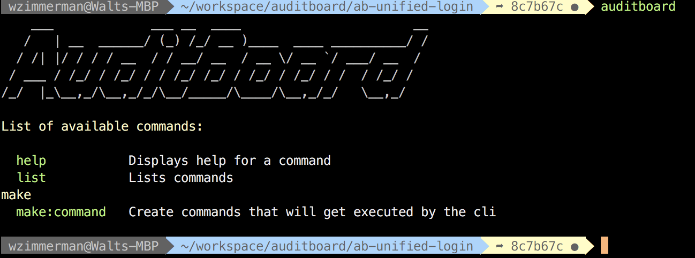
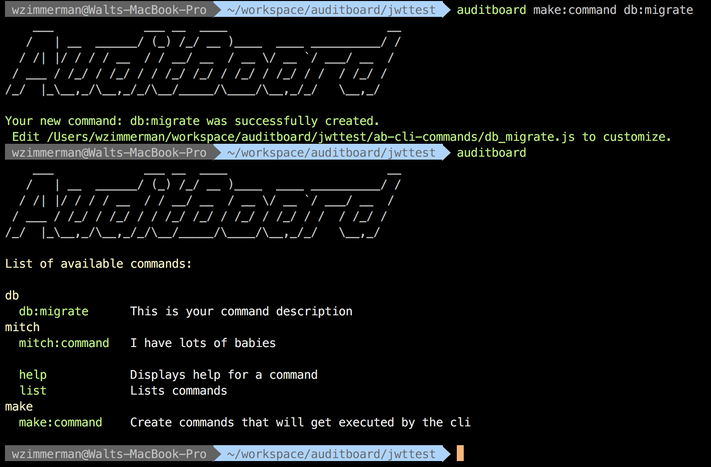

# Auditboard Cli



## Installation
```
$ yarn add auditboard-cli

$ npm install auditboard-cli
```

Make sure your projects `node_modules/.bin` is in your path.
```
$ export PATH=$PATH:$PWD/node_modules/.bin
```

## Why this CLI?
`auditboard-cli` is a cli that you can drop into any node project (>=v10) and automate anything you can write code for. Inspired by [Rake](https://guides.rubyonrails.org/v3.2/command_line.html) and [Artisan](https://laravel.com/docs/5.0/artisan) to help support developers maximise productivity. The commands you create live in the repo you install `auditboard-cli` in `<YOUR PROJECT ROOT>/ab-cli-commands`. We also support global creation of commands which live in `~/.ab-cli-commands`. If you want to delete a command just delete that file.

## Basic Usage

First thing to do when you get up and running is use the `make:command` (you can pass a `-g` or `--global` to the make command to install globally).



Now open the command file that was created.
```js
module.exports = {
	/**
	 * args get defined by the commandOptions interface below
	 * {
	 *   "firstParam": "users", <-- required params
	 *   "options": 11 <-- optional params
	 * }
	 */
	async command(args) {
		console.log("HELLO WORLD From my new command", args);
		return "Return a message and the cli will log it!";
	},
	commandOptions: {
		help: "This help string supports markdown!",
		description: "This is your command description",
		required: [
			/**
			 * This is where you put required params
			 * arguments are parsed sequentially
			 * example: ./auditboard make:command users -o 11
			 *
			 * This segment is how it got to this 
			 */
			{
				name: "firstParam", // <-- this value will be users
				message: 'Something went wrong...', // <-- (optional) failure message if param does not exist
			},
			// ... more required params
		],
		args: {
			// these are optional parameters
			// https://www.npmjs.com/package/args
			'--option': Number,
			'-o': '--option',
		}
	}
};
```

## Command API
`make:command` creates the above example let's walk through the interface.

### command
  ```js
    async command(args) {
      console.log("HELLO WORLD From my new command", args);
      return "Return a message and the cli will log it!";
    },
  ```
This is the function that get's executed. If you wanta custom message to display on command completion return a string

### commandOptions

- `help`
  - The message that get's displayed when a user runs `help`(supports markdown):
  ```
  $ auditboard help <your awesome command>
  ```
- `description`
  - The description that displays when you run `list`
- `required`
  - An array of parameter objects that are required to run your command. The engine does the validation.
  ```js
    required: [
      /**
        * This is where you put required params
        * arguments are parsed sequentially
        * example: ./auditboard make:command users -o 11
        *
        * This segment is how it got to this 
        */
      {
        name: "firstParam", // <-- this value will be users
        message: 'Something went wrong...', // <-- (optional) failure message if param does not exist
      },
      // ... more required params
    ],
  ```
- `args`
  - We leveraged the open source communuty for parsing optional arguments (you will be responsible for checking if they exist in your command function). See [Args docs](https://www.npmjs.com/package/args)

### Argument injection
Arguments (both optional and required) are injected into the command function. Keyed by name (for optional parms we remove `--`)

Our make command for example has required and optional commands  
Required:
```js
{
  name: "commandName",
  message: 'You need a command name to create a command... duh',
},
```
Optional:
```js
args: {
  "--global": Boolean,
  "-g": "--global"
}
```
We run the command...

```
$ auditboard make:command mynew:command -g
```
Inside the command function the arguments are

```js
async command(args) {
  // args.commandName => mynew:command
  // args.global => true
  ...
}
```

# Contributing
Feel free to create issues and open pull requests!

# License
[MIT](LICENSE) (AuditBoard <3 Open Source)